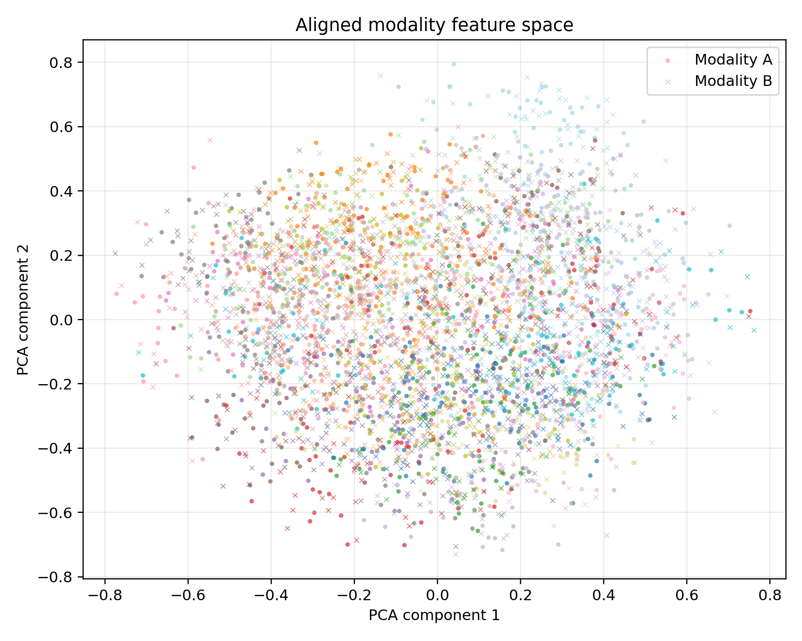
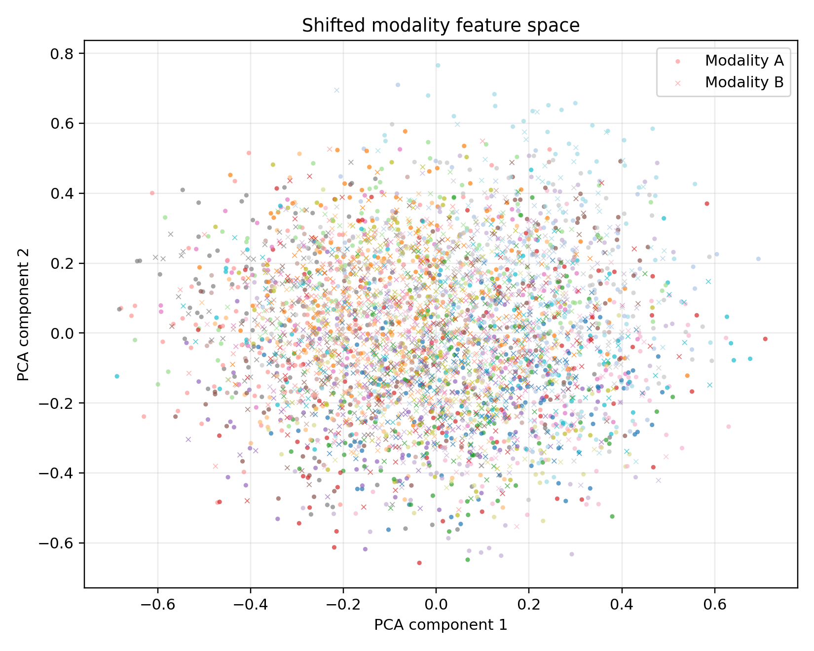
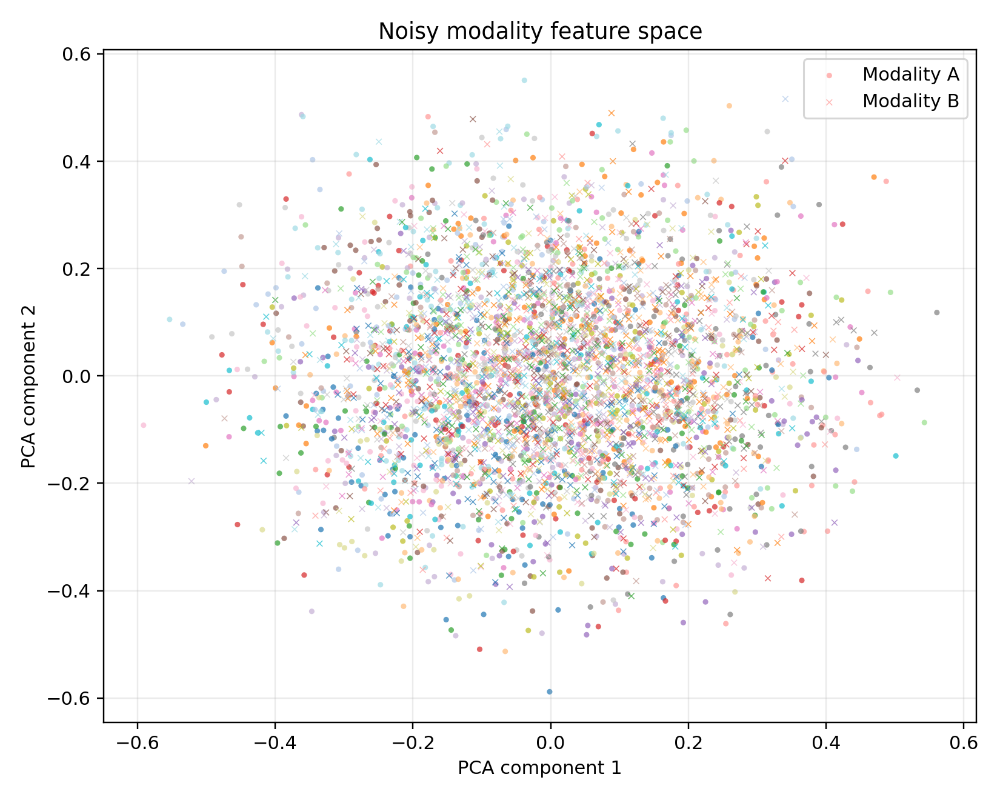

# Zeroshot Baseline Multimodal Retrieval

A lightweight benchmark for answering one uncomfortable but necessary question:

```text
Do we really need to train a model, or are simple retrieval baselines already strong?
```

This repository evaluates **no-training multimodal retrieval baselines** on controlled synthetic paired data. It is designed as a pre-training checkpoint: before building contrastive models, transformers, or alignment networks, first measure what simple similarity methods can already do.

---

## The Point of This Repo

Many retrieval projects start with model training too early.

This repo takes the opposite route:

```text
Step 1: create paired multimodal data
Step 2: do not train anything
Step 3: test simple similarity baselines
Step 4: use the results as a reality check
```

If a trained model cannot beat these baselines, the model is not adding enough value.

---

## Baseline Checklist

This project compares six retrieval baselines:

| Baseline | Why it is included |
|---|---|
| Random | Checks what chance-level retrieval looks like |
| Raw feature | Tests whether the original feature space is already useful |
| Metadata only | Tests whether metadata alone can retrieve pairs |
| PCA projected | Tests whether simple compression improves similarity search |
| Random projection | Tests whether approximate geometry is enough |
| Oracle latent | Gives an upper-bound reference using hidden semantic vectors |

The oracle latent baseline is not a real deployment method. It exists only to show the best possible retrieval if the shared hidden structure were directly visible.

---

## Dataset Stress Tests

The benchmark uses three controlled retrieval conditions:

```text
aligned  -> modalities are already close
shifted  -> one modality is transformed away
noisy    -> feature and metadata signals are weakened
```

And three candidate-pool sizes:

```text
6000
12000
18000
```

Full benchmark size:

```text
3 conditions × 3 sample sizes × 6 baselines = 54 runs
```

---

## What Makes This Different

This is not an architecture repo.

This is not a loss-function repo.

This is not a pair-construction repo.

This is a **baseline audit repo**.

Its job is to answer:

```text
What retrieval performance is already available from the existing representation space before task-specific training?
```

That makes it useful before starting heavier multimodal experiments.

---

## Files That Matter

```text
src/make_demo_data.py        -> creates synthetic paired multimodal data
src/evaluate_baselines.py    -> evaluates one zero-shot baseline
src/run_benchmark.py         -> runs the full 54-run benchmark
src/collect_results.py       -> collects all metrics into one table
src/metrics.py               -> retrieval metric utilities
```

Results:

```text
experiments/results_table.csv
experiments/results_summary.md
```

---

## Quick Run

Install dependencies:

```powershell
pip install -r requirements.txt
```

Generate one dataset:

```powershell
python src/make_demo_data.py --mode shifted --n-samples 6000 --n-groups 60
```

Evaluate one baseline:

```powershell
python src/evaluate_baselines.py --baseline pca_projected
```

Run everything:

```powershell
python src/run_benchmark.py
python src/collect_results.py
```

---

## Reading the Output

The important metrics are:

| Metric | Meaning |
|---|---|
| Recall@1 | Correct pair ranked first |
| Recall@10 | Correct pair found in top 10 |
| Recall@50 | Correct pair found in top 50 |
| Lift@K | Improvement over random retrieval |
| Positive similarity | Similarity assigned to true pairs |

The full interpretation is here:

- [Result summary](experiments/results_summary.md)
- [Raw result table](experiments/results_table.csv)

---

## Feature-Space Visualizations

The PCA plots below show how the two generated modality feature spaces behave under aligned, shifted, and noisy benchmark conditions.

| Aligned | Shifted | Noisy |
|---|---|---|
|  |  |  |

Each point is one sample after projecting the generated feature vectors into 2D with PCA.

- **Circles** represent **modality A**, the query-side feature space.
- **Crosses** represent **modality B**, the candidate-side feature space.
- **Colors** indicate the underlying synthetic group identity.

| Visual pattern | Interpretation |
|---|---|
| Same-colored circles and crosses overlap | The two modalities preserve similar group structure, so zero-shot retrieval is easier. |
| Same-colored circles and crosses are shifted apart | The cross-modal alignment problem is harder because matching samples occupy different regions. |
| Points become scattered or mixed by noise | Shared structure is less reliable, which helps explain weaker retrieval performance. |

| Panel | Main takeaway |
|---|---|
| **Aligned** | Modality A and B are more compatible, so raw feature and PCA baselines can perform strongly. |
| **Shifted** | The modalities are displaced, making raw similarity harder and making PCA projection more useful. |
| **Noisy** | Group structure is less clean, matching the drop in retrieval performance across practical baselines. |

These figures are qualitative diagnostics. The main conclusions come from the quantitative retrieval results in `experiments/results_table.csv`.

### How to read these plots

If circles and crosses with the **same color** appear close to each other or overlap, it suggests that the two modalities preserve similar group structure. This usually makes zero-shot retrieval easier.

If same-colored circles and crosses are visibly **shifted apart**, the cross-modal alignment problem becomes harder, because corresponding samples occupy different regions of feature space.

If the plot becomes more **scattered or mixed by noise**, the shared structure becomes less reliable, which helps explain weaker retrieval performance.

### Condition-level interpretation

- **Aligned:** same-colored circles and crosses overlap more often, indicating that the two modalities are already compatible.
- **Shifted:** same-colored groups are still present, but circles and crosses are displaced, showing a domain gap between modalities.
- **Noisy:** group structure becomes less clean, and overlap between corresponding modality samples is reduced, which matches weaker retrieval performance.

These figures are qualitative diagnostics. The main conclusions of the benchmark come from the quantitative retrieval results in `experiments/results_table.csv`.

---

## Main Lesson

The benchmark shows a simple pattern:

```text
aligned data  -> raw feature and PCA baselines are already very strong
shifted data  -> PCA becomes the strongest practical baseline
noisy data    -> all simple baselines degrade, leaving room for learned alignment
```

So the practical rule is:

```text
Do not celebrate a trained retrieval model until it beats strong no-training baselines.
```

---

## Research Context

This repo follows the same mindset as zero-shot multimodal evaluation: before adding task-specific training, first test whether an existing representation space already supports retrieval.

The main reference point is CLIP, which showed that multimodal representations can transfer to new tasks through zero-shot evaluation. This project does not use CLIP or pretrained image-text encoders, but it borrows the evaluation habit: measure retrieval performance before training anything new.

The PCA baseline connects to classical dimensionality reduction. Here, PCA is used as a simple no-training transformation to test whether compression can preserve shared cross-modal structure while reducing noise.

The random-projection baseline is included as a minimal geometry-preserving reference. It asks whether a cheap linear projection can retain enough neighborhood structure for retrieval.

So the repo is not trying to introduce a new model. It is trying to build a clean baseline floor that future trained models must beat.

---

## References

- Alec Radford, Jong Wook Kim, Chris Hallacy, Aditya Ramesh, Gabriel Goh, Sandhini Agarwal, Girish Sastry, Amanda Askell, Pamela Mishkin, Jack Clark, Gretchen Krueger, and Ilya Sutskever. *Learning Transferable Visual Models From Natural Language Supervision*. ICML, 2021.
- Harold Hotelling. *Analysis of a Complex of Statistical Variables into Principal Components*. Journal of Educational Psychology, 1933.
- Ian T. Jolliffe. *Principal Component Analysis*. Springer, 2002.
- William B. Johnson and Joram Lindenstrauss. *Extensions of Lipschitz mappings into a Hilbert space*. Contemporary Mathematics, 1984.

---

## What This Repo Is and Is Not

This repository is a baseline validation study for multimodal retrieval.

It is designed to establish a rigorous reference point before introducing trained alignment models. In retrieval research, a model is only meaningful if it improves over strong non-trained baselines, not only over random chance.

The benchmark uses synthetic data so that the retrieval difficulty can be controlled through aligned, shifted, and noisy settings. This makes it possible to inspect how different baseline methods behave when the modality relationship becomes easier or harder.

The intended use of this repo is:

```text
establish the retrieval floor
measure non-trained baseline strength
identify when learned alignment is actually needed
```

## Documentation

- [Baseline validation notes](docs/baseline_validation_notes.md)
- [Zero-shot metric guide](docs/zero_shot_metric_guide.md)
- [Benchmark protocol](docs/benchmark_protocol.md)